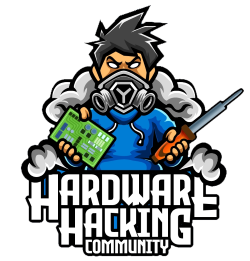

  

#Hardware Hacking Community 2022
##Circuit Learning Minibadge

The goal of the minibadge this year is to provide a platform for you to learn about basic analog electronic circuits.  You'll need to acquire a kit from the HHC area, and then take it to the Solder Skills Community to assemble it.  Once you have completed that, download the circuits workbook and get started on your journey.

[Assembly Guide](assembly.md)

[Circuits Workbook](circuits-workbook.pdf)