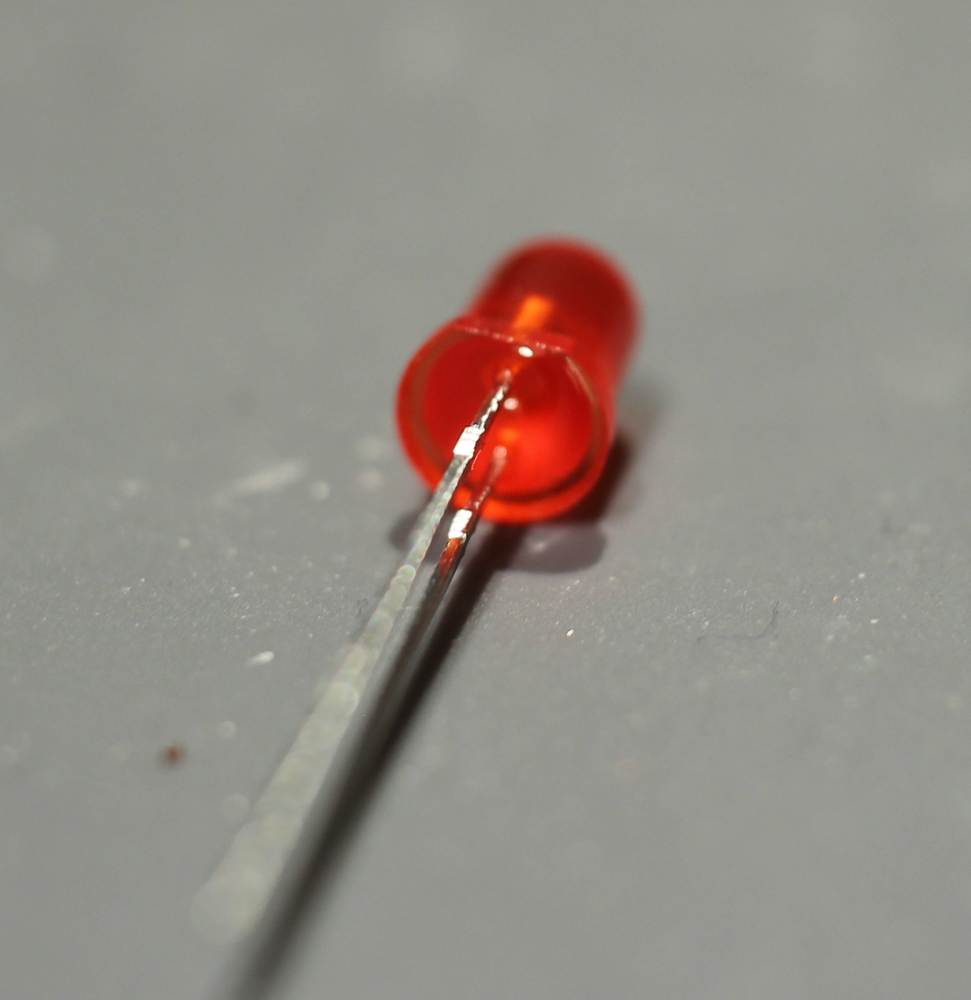
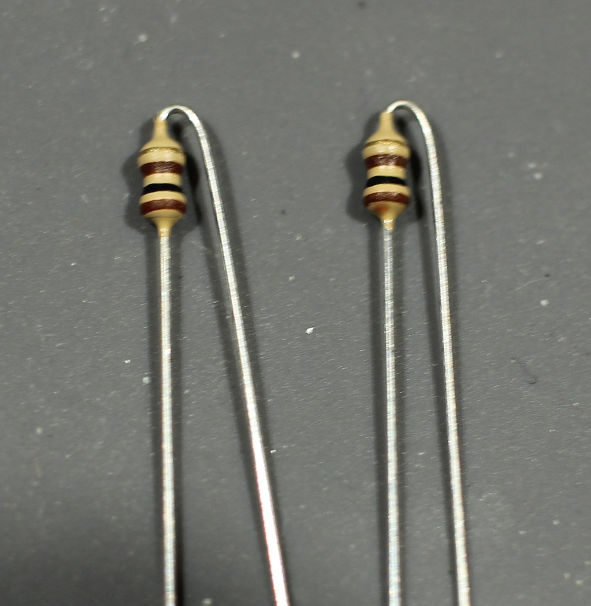

# Minibadge Assembly

To see a video of this assembly, [go here](https://gihub.com)

To get started, open your bag of parts and lay them out.  You should have the following items:

* The minibadge panel consisting of 4 minibadges
* A 555 chip
* 2 each of 100 ohm, 1k ohm, 10k ohm and 100k ohm resistors
* 3 capacitors, values of 1000uF, 100uF and 10uF
* Two LEDs, a red and blue
* One push button
* A 40 pin header
* A 40 pin socket
* Approx 8 jumper wires

If you do not have any jumper wires, pick up about 8 of them from the HHC area.

We also suggest that you do not break apart the panel of badges just yet.

The first thing to do is to cut up your header.  You can use your fingers to snap it apart, but the best method is to get some wire snippers.  We have some at the HHC area you can borrow.

You will need:

* 7 two pin sockets
* 22 one pin sockets

Now that you have your sockets, place them into the holes as shown below.  The holes you need to use are the ones with the square outlines.  They won't sit flat, but that's OK.

Once you are done, it should look like this

Now, pick the board up and let all the sockets fall down into the holes.  Place a piece of card stock or plastic over the top, and while pressing firmly, flip the whole thing upside down.  This can be a little tricky, just make sure you apply pressure until you get it flipped and back onto the table.

Now solder up the sockets.

Now we want to work from the next tallest part down, more or less.  Insert the switch and flip the board over.  It won't stick through all the way, but you can still solder it, like this.

Let's start in on the componets.  Locate the LEDs.  Note carefully that one leg is shorter than the other, and also that the LED itself has a flat on the body of the LED on that same side.  This is the 'cathode' or negative side.  Note that the PCB also shows a circle with a flat side.  These two things need to line up.

It doesn't matter which color you put where, but the 'default' is red for low, green for high.  Or swap with a buddy and get two red LEDs.  Go crazy.

Insert, and hold it flush with the board, then on the back side bend the leads at an angle to hold the LED while you solder.  We'll be using this technique for the rest of the parts.

Once they are soldered, take your flush cuts and nip off the led.  Don't cut off the solder ball, just the lead.  Point the board so that the leads hit the table, or otherwise block the ends from flying off and blinding children.

Next insert the capacitors.  Note that the two electrolytic caps (the bigger ones) have a stripe that is the negative.  The PCB also has a white area.  Line these two things up.

Now for the chip.  Note that the leads of the chip kinda stick out a little too far.  You will need to carefully place the chip on the side of the table and apply a little pressure to bend the leads square.  Don't overbend, or at least, don't do it too many times.

Insert into the board, and use the little foam anti-static thingy to hold the chip up.  Solder just one pin.  Hold it up and check if the chip is sitting flat.  If not, apply a squeezing pressure with one hand, and tap the soldered pin with your iron using your other hand, and the chip will sit down.  Now you can solder the rest of the pins.

When you insert the chip, look for the little dot or shiny area at one corner on the top.  This is pin 1.  Make sure you line this up with the 1 on the 555 board as shown.

Resistors.  You have 8 total in 4 values.  Use the resistor color code sheet, or a multimeter, to find out which is which.  Hints:

* Brown-Black-Brown is 100 ohms
* Brown-Black-Red is 1k ohms
* Brown-Black-Orange is 10k ohms
* Brown-Black-Red is 100k ohms

You will need to bend the LED legs such that one is bent all the way over, so that the resistors will end up standing.

Use the same techniques from above to insert and bend over a leg, solder, and clip.  You should end up with a panel like below.

Good work.  Now we can snap these apart.  Carefully snap them apart - you might wiggle them back and forth a bit to get them to snap.  It should go pretty easy.

Now we need to break the pin headers up into 16 two pin headers like shown.  Use the wire snippers or your fingers.

We feel the best way to do this is to find a minibadge socket and use that.  If you are using your badge, power it off first, please.  Insert the pins into the socket, place the minibadge onto the pins, and solder.

You've done it!  Now go back to download the circuit workbook and have fun learning about circuits.

[@hamster](https://twitter.com/hamster)
